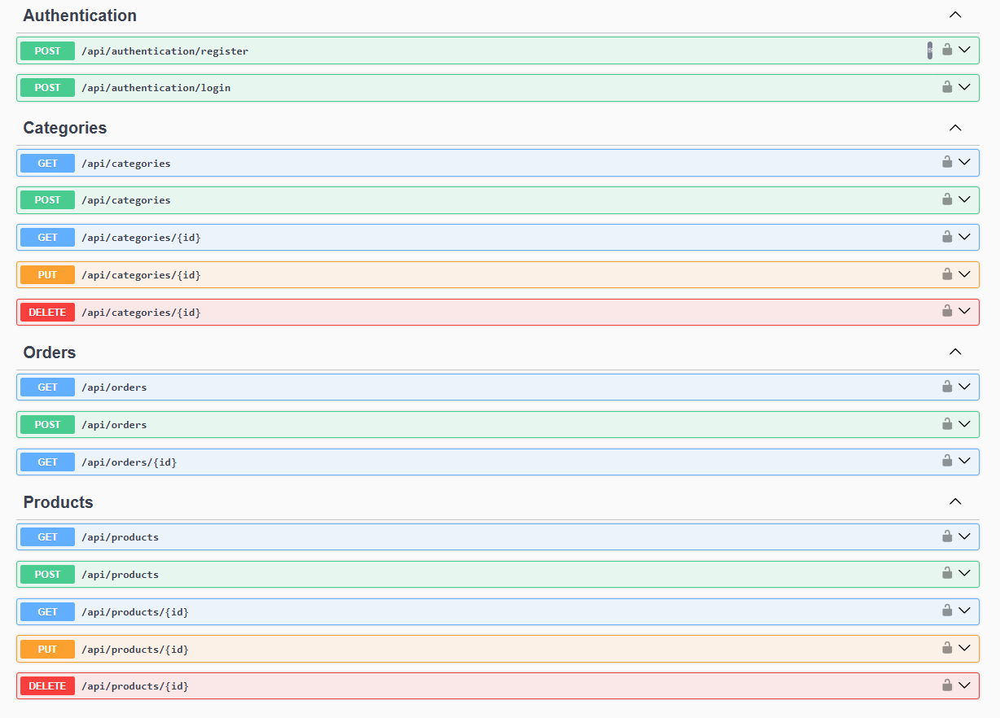
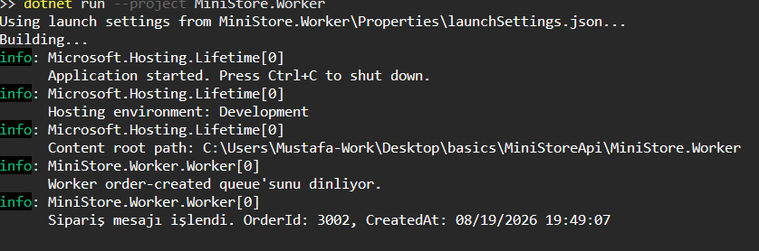
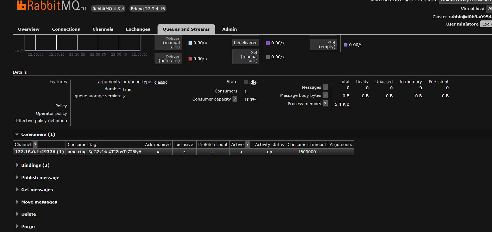

# MiniStoreApi

[](https://dotnet.microsoft.com/)
[](#testing)
[](#docker)
[](#license)

MiniStoreApi is a backend-focused e-commerce Web API developed with ASP.NET Core as a learning project for applying common backend development concepts and infrastructure tools in a single application.

The project follows a layered architecture and includes authentication and authorization, product and category management, order processing, searching, filtering, pagination, distributed caching with Redis, asynchronous messaging with RabbitMQ, automated tests, and Docker-based containerization.

## Table of Contents

- [Tech Stack](#tech-stack)
- [Architecture](#architecture)
- [Quick Start](#quick-start)
- [Screenshots](#screenshots)
- [API Endpoints](#api-endpoints)
- [Features](#features)
- [Design Decisions](#design-decisions)
- [Redis Caching](#redis-caching)
- [RabbitMQ Messaging](#rabbitmq-messaging)
- [Testing](#testing)
- [Security](#security)
- [Project Purpose](#project-purpose)

## Tech Stack

- C#
- ASP.NET Core Web API
- Entity Framework Core
- SQL Server
- ASP.NET Core Identity
- JWT Authentication
- AutoMapper
- Redis
- RabbitMQ
- Docker / Docker Compose
- xUnit / Moq

## Architecture

The application is organized using a layered architecture.

```text
Client / Swagger
        |
        v
Presentation
Controllers
        |
        v
Services
Business Logic
        |
        v
Repositories
Data Access
        |
        v
Entity Framework Core
        |
        v
SQL Server
```

Main projects:

```text
MiniStoreApi
|
|-- Entities
|   |-- Models
|   |-- DTOs
|   |-- Exceptions
|   |-- RequestFeatures
|   |-- MessageModels
|
|-- Repositories
|   |-- Contracts
|   |-- EFCore
|   |-- Extensions
|   |-- Migrations
|
|-- Services
|   |-- Contracts
|   |-- Mapping
|   |-- Messaging
|
|-- Presentation
|   |-- Controllers
|
|-- WebApi
|   |-- Program.cs
|   |-- Extensions
|   |-- Data
|
|-- MiniStore.Worker
|
|-- MiniStoreApi.Tests
|
|-- MiniStoreApi.IntegrationTests
```

## Quick Start

```bash
# 1. Clone the repository
git clone https://github.com/mustafakck-dev/MiniStoreApi.git
cd MiniStoreApi

# 2. Set up environment variables
cp .env.example .env
# (on Windows, create .env manually from .env.example)

# 3. Start the infrastructure (API, SQL Server, Redis, RabbitMQ)
docker compose up -d --build

# 4. Run the background worker (in a separate terminal)
$env:RabbitMq__Host="localhost"
$env:RabbitMq__UserName="ministore"
$env:RabbitMq__Password="YourRabbitMqPasswordHere"
dotnet run --project MiniStore.Worker
```

Once running, the application is available at:

| Service | URL |
|---|---|
| API (Swagger) | http://localhost:8081/swagger |
| RabbitMQ Management UI | http://localhost:15672 |

## Screenshots

**Swagger UI** — full endpoint surface (Authentication, Categories, Orders, Products):



**Worker consuming a message** — the background Worker connects, listens on `order-created`, and processes an incoming order end-to-end:

```text
info: MiniStore.Worker.Worker[0]
      Worker order-created queue'sunu dinliyor.
info: MiniStore.Worker.Worker[0]
      Sipariş mesajı işlendi. OrderId: 3002, CreatedAt: 08/19/2026 19:49:07
```



**RabbitMQ Management UI** — the `order-created` queue with the Worker actively attached as a consumer using manual acknowledgement:



> To reproduce: start the full stack with `docker compose up -d --build`, run the Worker (`dotnet run --project MiniStore.Worker`), then create an order via Swagger (`POST /api/orders`). The Worker log will show the message being consumed, and the RabbitMQ Management UI (`http://localhost:15672` → Queues and Streams → `order-created`) will show `Consumers: 1` with manual ack enabled.

## API Endpoints

| Method | Endpoint | Auth | Description |
|---|---|---|---|
| POST | `/api/authentication/register` | No | Register a new user |
| POST | `/api/authentication/login` | No | Authenticate and receive a JWT |
| GET | `/api/categories` | No | List categories |
| POST | `/api/categories` | Admin | Create a category |
| GET | `/api/categories/{id}` | No | Get a single category |
| PUT | `/api/categories/{id}` | Admin | Update a category |
| DELETE | `/api/categories/{id}` | Admin | Delete a category |
| GET | `/api/orders` | User | List orders |
| POST | `/api/orders` | User | Create an order (validates stock, publishes `OrderCreatedMessage`) |
| GET | `/api/orders/{id}` | User | Get order details |
| GET | `/api/products` | No | List products (search, filter, sort, paginate) |
| GET | `/api/products/{id}` | No | Get a single product |
| POST | `/api/products` | Admin | Create a product |
| PUT | `/api/products/{id}` | Admin | Update a product |
| DELETE | `/api/products/{id}` | Admin | Delete a product |

## Features

### Product Management

- Product creation, retrieval, updates, deletion
- Category-based filtering
- Price filtering
- Searching
- Sorting
- Pagination (metadata returned via the `X-Pagination` response header)

```http
GET /api/products?pageNumber=1&pageSize=10
```

### Category Management

Categories are managed separately and are associated with products through Entity Framework Core relationships.

### Authentication

Authentication is implemented using ASP.NET Core Identity and JWT.

```text
User Login
    |
    v
ASP.NET Core Identity
    |
    v
Credentials Validated
    |
    v
JWT Generated
    |
    v
Client sends JWT with requests
```

```http
Authorization: Bearer <token>
```

### Role-Based Authorization

```text
User
Admin
```

```text
GET     -> Public
POST    -> Admin
PUT     -> Admin
DELETE  -> Admin
```

### Order Processing

```text
Create Order Request
        |
        v
Validate Products
        |
        v
Check Stock
        |
        v
Decrease Stock
        |
        v
Create Order Items
        |
        v
Calculate Total Price
        |
        v
Save Order
```

Custom exceptions handle scenarios such as product/category/order not found, invalid price range, and insufficient stock. A centralized exception handler converts these into appropriate HTTP responses.

## Design Decisions

A few deliberate architectural choices worth calling out:

- **Cache-aside over write-through.** Reads are far more frequent than writes for product data in this domain, so cache-aside keeps writes simple (write to DB, then invalidate) rather than paying the complexity cost of keeping the cache and DB synchronized on every write.
- **Manual ACK/NACK instead of automatic acknowledgement.** Auto-ack would mark a message as processed the instant RabbitMQ delivers it — if the Worker crashed mid-processing, the message would be lost. Manual ACK guarantees a message is only removed from the queue after it has been successfully handled, with NACK/requeue as the fallback for failures.
- **Layered architecture instead of Clean Architecture.** For the scope of this project (a single bounded domain, no need to swap infrastructure), a layered approach keeps the mental model simple while still enforcing separation between API, business logic, and data access. Clean Architecture's extra abstraction (use cases, inversion at the domain boundary) is explored in a follow-up project ([EventHub](#), still in progress) where the added complexity is actually justified by multiple modules and stricter domain isolation.

## Redis Caching

Redis is used as a distributed cache, applying the cache-aside pattern for frequently requested product data.

```text
GET Product
     |
     v
Check Redis
  /       \
Hit       Miss
 |          |
Return    SQL Server
            |
            v
         Cache Data
            |
            v
          Return
```

Cache invalidation is performed when product data changes to prevent stale data from being returned.

## RabbitMQ Messaging

RabbitMQ is used for asynchronous order-created messages.

**Producer flow:**

```text
OrderService
     |
     v
OrderCreatedMessage
     |
     v
RabbitMqPublisher
     |
     v
ministore.orders Exchange
     |
     | order.created
     v
order-created Queue
```

**Consumer flow:**

```text
order-created Queue
        |
        v
MiniStore.Worker
        |
        v
Deserialize Message
        |
        v
Process Message
        |
        v
ACK
```

The Worker uses manual acknowledgements so messages are acknowledged only after successful processing, with NACK/requeue behavior for failed processing.

**Topology:**

| | Value |
|---|---|
| Exchange | `ministore.orders` |
| Queue | `order-created` |
| Routing Key | `order.created` |

## Docker

```text
ASP.NET Core API
SQL Server
Redis
RabbitMQ
```

### Environment Variables

```env
MSSQL_SA_PASSWORD=YourStrongPasswordHere
DATABASE_NAME=MiniStoreDb
DATABASE_USER=sa
API_PORT=8081
DATABASE_PORT=1433

RABBITMQ_USER=ministore
RABBITMQ_PASSWORD=YourRabbitMqPasswordHere
```

The real `.env` file is excluded from Git — see [Quick Start](#quick-start) for setup.

## Database

SQL Server is used as the relational database. Entity Framework Core handles entity mapping, relationships, LINQ queries, migrations, database access, and change tracking. Migrations are stored under `Repositories/Migrations`.

## Testing

The solution contains both unit tests and integration tests.

**Unit tests** focus on service-layer business logic using xUnit and Moq, with repositories, AutoMapper, logging, and cache services mocked.

**Integration tests** validate multiple components working together:

```text
HTTP Request
    |
    v
Middleware
    |
    v
Authentication / Authorization
    |
    v
Controller
    |
    v
Service
    |
    v
Repository
    |
    v
Database
```

```bash
dotnet test MiniStoreApi.slnx
```

```text
Total tests: 16
Passed: 16
Failed: 0
```

```bash
dotnet build MiniStoreApi.slnx
```

## Security

Sensitive values (database passwords, RabbitMQ credentials, JWT secrets) are never committed to source control. `.gitignore` excludes local secrets such as `.env` and `appsettings.Development.json`. Example configuration files contain placeholder values only.

## Project Purpose

MiniStoreApi was built to go beyond basic CRUD and practice the infrastructure decisions that separate a tutorial project from a production-minded one: how to keep a cache consistent with its source of truth, how to process messages reliably instead of just "sending" them, and how to structure a codebase so business rules don't leak into controllers.

The hardest part was getting message acknowledgement right — moving from an auto-ack setup (where a Worker crash silently loses orders) to manual ACK/NACK forced a much better understanding of what "reliable messaging" actually guarantees, and what it doesn't. That question — how does a system stay correct under concurrent load and partial failure — is the direct motivation for the next project, [EventHub](#), which focuses on concurrency, transactions, and distributed systems in more depth.